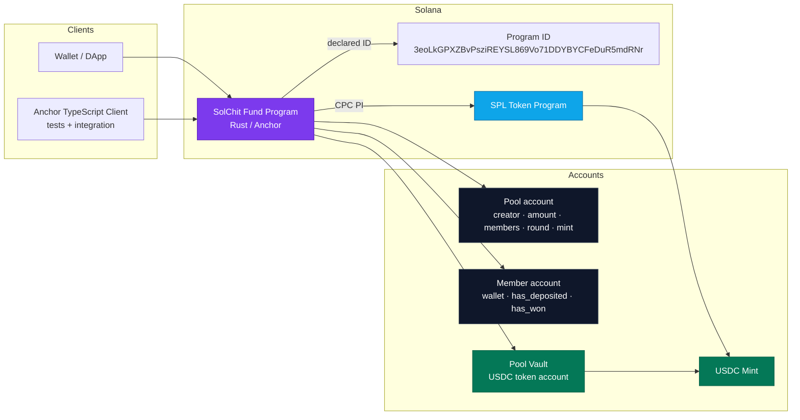
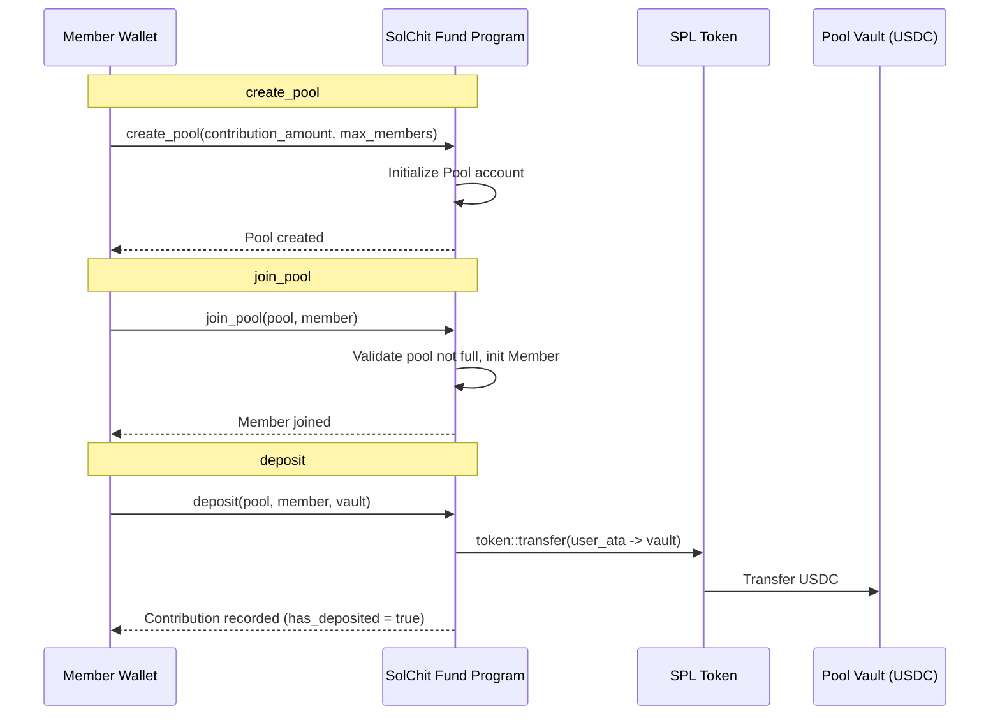

# 🏗 SolChit Fund 3.0

> A decentralized rotating savings protocol (ROSCA / Chit Fund) built on Solana.

SolChit Fund is an **on-chain chit fund (ROSCA)** that replaces the traditional
trust-based organizer with deterministic program logic, transparent accounting,
and program-controlled (PDA) token vaults.

Members contribute a fixed USDC amount each round into a shared vault. The
protocol enforces contribution rules and custody on-chain, removing the need
for a central coordinator to hold or manage funds.

Built with **Rust + Anchor** on the **Solana** blockchain, with a
**TypeScript (Anchor IDL) client** for tests and integration.

---

## ✨ Features

- **Pool creation** : configure the per-member contribution amount and the
  maximum number of members (`create_pool`).
- **Member onboarding** : any wallet can join a pool while it is not full,
  with an automatic `Member` account initialized (`join_pool`).
- **On-chain contribution enforcement** : a member cannot deposit twice; the
  program validates membership and pool state before moving funds (`deposit`).
- **USDC vault custody** : contributions are transferred via SPL Token CPI
  from the member's token account into the pool vault.
- **PDA-based program authority** : accounts are governed by the program,
  with Anchor account constraints and validation on every instruction.
- **Deterministic accounting** : each member's deposit state is tracked in a
  dedicated account (`has_deposited`).

> ⚠️ This is **phase 1** of the protocol. Round rotation, winner selection and
> payout (the "fund rotation" mechanics) are on the roadmap — see
> [Roadmap](#-roadmap).

---

## 🧱 Architecture



### Flow overview



---

## 📦 Tech Stack

| Layer        | Technology                                          |
| ------------ | --------------------------------------------------- |
| Blockchain   | Solana (Devnet / Localnet)                          |
| Smart contract | Rust + Anchor (`anchor-lang 0.31`)                |
| Token vault  | SPL Token Program (`anchor-spl`, USDC)              |
| Client       | TypeScript + `@coral-xyz/anchor` (IDL-based)        |
| Testing      | Mocha + `ts-mocha`                                  |
| Tooling      | Anchor CLI, Yarn, Prettier                          |

---

## 🧩 Program Accounts

### `Pool`
Tracks a single chit fund group.

| Field                 | Type    | Description                        |
| --------------------- | ------- | ---------------------------------- |
| `creator`             | `Pubkey`| Wallet that created the pool       |
| `contribution_amount` | `u64`   | Per-member contribution per round  |
| `max_members`         | `u8`    | Maximum number of members          |
| `current_members`     | `u8`    | Number of members joined so far    |
| `current_round`       | `u8`    | Current round index                |
| `usdc_mint`           | `Pubkey`| USDC mint authorized for the pool  |

### `Member`
Tracks an individual member's state within a pool.

| Field          | Type    | Description                          |
| -------------- | ------- | ------------------------------------ |
| `wallet`       | `Pubkey`| Member's wallet address              |
| `has_deposited`| `bool`  | Whether the member deposited         |
| `has_won`      | `bool`  | Whether the member won a round       |

---

## ⚙️ Instructions

| Instruction   | Signature                                        | Purpose                                   |
| ------------- | ------------------------------------------------ | ----------------------------------------- |
| `create_pool` | `create_pool(contribution_amount, max_members)`  | Create a new pool with group parameters   |
| `join_pool`   | `join_pool()`                                    | Join a pool and initialize a `Member`     |
| `deposit`     | `deposit()`                                      | Transfer the contribution into the vault  |

### Error Codes

| Code  | Message             |
| ----- | ------------------- |
| `0x0` | `Pool is full`      |
| `0x1` | `Already deposited` |

---

## 🚀 Getting Started

### Prerequisites

- [Rust](https://rustup.rs/) (stable toolchain)
- [Solana CLI](https://docs.solanalabs.com/cli/install)
- [Anchor CLI](https://www.anchor-lang.com/docs/installation) (`v0.31+`)
- [Node.js](https://nodejs.org/) (16+) and [Yarn](https://classic.yarnpkg.com/)

### 1. Install dependencies

```bash
yarn install
```

### 2. Build the program

```bash
anchor build
```

### 3. Start a local validator

```bash
solana-test-validator
```

### 4. Deploy to localnet

```bash
anchor deploy
```

### 5. Run the test suite

```bash
anchor test
```

---

## 🧪 Testing

Tests live in [`tests/solchit-fund.ts`](./tests/solchit-fund.ts) and run against
a local validator via `anchor test`. They exercise the on-chain instructions
through the generated Anchor IDL (`@coral-xyz/anchor`).

---

## 📁 Project Layout

```text
.
├── programs/
│   └── solchit-fund/
│       ├── Cargo.toml          # Rust crate config
│       └── src/
│           └── lib.rs          # Program logic, accounts & instructions
├── migrations/
│   └── deploy.ts               # Deployment migration script
├── tests/
│   └── solchit-fund.ts         # Anchor integration tests
├── Anchor.toml                 # Anchor workspace configuration
├── Cargo.toml                  # Workspace manifest
└── package.json                # JS/TS client dependencies
```

---

## 🗺 Roadmap

- [x] Pool creation & member onboarding
- [x] Contribution (deposit) into a USDC vault
- [ ] Round rotation & deterministic winner selection
- [ ] Payout / fund disbursement to winners
- [ ] `has_won` lifecycle enforcement
- [ ] USDC mint validation & vault authority PDA
- [ ] Web3 / Next.js frontend (wallet integration)

---

## 📄 License

Distributed under the **ISC** license. See [`package.json`](./package.json).
